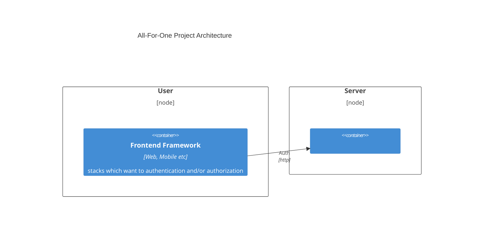

```mermaid
C4Context
title All-For-One Project Architecture

Deployment_Node(user_side, "User") {
    Container(frontend, "Frontend Framework", "Web, Mobile etc", $descr="stacks which want to authentication and/or authorization")
}

Deployment_Node(server_side, "Server") {
    Container(backend, "", "")
}

Rel_D(frontend, backend, "Auth", "http")


```